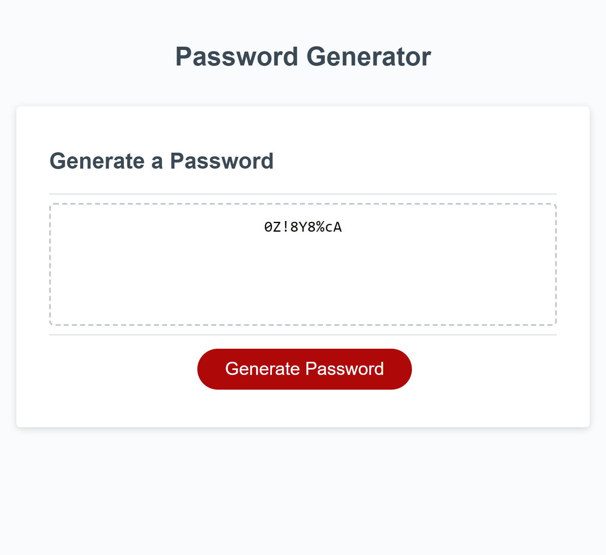

# password-generator

[Click to view deployed application](https://cariberrii.github.io/password-generator/)

## Description
 
 This password generator stores input from the user via prompts and confirms to produce a random password from a set of given character types. The code is organized into multiple functional code blocks which are executed, or called, in a final function to generate the password. This makes it easier to debug and understand what the functionality of each section is. 

 There are multiple concerns to address with user input, such as the user entering no data or data that is unrelated to the prompt, and an acceptable input must be validated by passing through a conditional statement. 
 One requirement which remains an additional step in my understanding of JavaScript is how to ensure that at least one of each character type requested by the user will appear in the password. In theory, I understand using the .some method to test the generated password contains a character from each array would work, but in practice I will need to see it in action at least once in this context to fully grasp the concept and reapply in another setting.

 

## Table of Contents

- [Console Screenshot](#console-screenshot)
- [License](#license)

## Console Screenshot

## License

MIT License

Copyright (c) 2023 Cari Fillingham

Permission is hereby granted, free of charge, to any person obtaining a copy
of this software and associated documentation files (the "Software"), to deal
in the Software without restriction, including without limitation the rights
to use, copy, modify, merge, publish, distribute, sublicense, and/or sell
copies of the Software, and to permit persons to whom the Software is
furnished to do so, subject to the following conditions:

The above copyright notice and this permission notice shall be included in all
copies or substantial portions of the Software.

THE SOFTWARE IS PROVIDED "AS IS", WITHOUT WARRANTY OF ANY KIND, EXPRESS OR
IMPLIED, INCLUDING BUT NOT LIMITED TO THE WARRANTIES OF MERCHANTABILITY,
FITNESS FOR A PARTICULAR PURPOSE AND NONINFRINGEMENT. IN NO EVENT SHALL THE
AUTHORS OR COPYRIGHT HOLDERS BE LIABLE FOR ANY CLAIM, DAMAGES OR OTHER
LIABILITY, WHETHER IN AN ACTION OF CONTRACT, TORT OR OTHERWISE, ARISING FROM,
OUT OF OR IN CONNECTION WITH THE SOFTWARE OR THE USE OR OTHER DEALINGS IN THE
SOFTWARE.